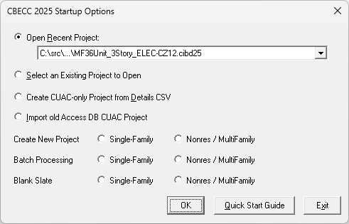
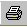
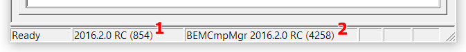
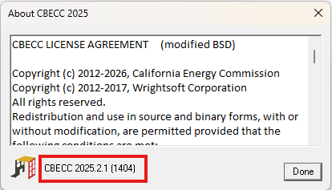

# Quick Start Guide
_CBECC_ is an open-source software program developed by the California Energy Commission for use in showing compliance with the _2025 Building Energy Efficiency Standards_ for nonresidential, multifamily and single family residential buildings. This guide provides a brief overview of the software program’s user interface when initializing the software for the first time.

## Starting a New Project

When CBECC is first started, a dialog box will appear with the options below:

Option 1 and Option 2 are essentially the same, except that the "Open Recent Project" option automatically selects the project that was being worked on the last time CBECC was open. The "Select an Existing Project to Open" option simply requires browsing to the desired project.

If "Select an Existing Project to Open" is selected, the default file type in the browse window is either a `.ribd25` or `.cibd25` file. However, this can be changed to `.ribd25x`, `.cibd25x` or `.xml`, allowing you to open an SDD XML file. This option should be used when working on a Detailed Geometry project.

"Create CUAC-only Project from Details CSV" - This feature enables users to import an existing CUAC project hourly results simulated in an earlier version of CBECC (e.g. CBECC 2022) using the details CSV file that was generated for that analysis. Once imported users can then generate an updated rate analysis using the new rates without having to import and re-simulate the model in the new version of CBECC.

The **Import old Access DB CUAC Project** option is for importing legacy Access DB CUAC project files.

The rest of the options, **Create New Project** and **Batch Processing**, allow you to select the project type—Single Family vs Nonresidential/Multifamily.

---

## Tool Bar

This section explains the program features you access by selecting the icons on the toolbar at the top of the screen.

### New File

 This button closes the current file (if one is open) and opens a new file.

### Open Existing File

 This button closes the current file (if one is open) and launches the _Open_ dialog to enable you to select an existing file to open.

### Save File

 This button saves the file under its current name or, if you have not named the file, launches the _Save As_ dialog to enable you to provide a new file name.

### Cut Selected Item

 This button is not currently enabled in CBECC.

### Copy Selected Item

 This button enables you to copy the selected item on the tree control (along with any child components) to the Windows clipboard. The _Copy_ button is not available from within program dialogs, but you can use the keyboard equivalent, **Ctrl+C**, to copy selected text.

### Paste Contents of Clipboard

 This button enables you to paste components copied from the tree control to the selected location in the tree control (provided that location is compatible with the stored component). The _Paste_ button is not available from within program dialogs, but you can use the keyboard equivalent, **Ctrl+V**, to paste text from the Windows clipboard to the selected input field.

### Print

 This function is not available in CBECC.

### Building Creation Wizard
This function is not available in CBECC.

### Perform Analysis

 This button enables you to launch a compliance analysis using the currently loaded building description. The behavior of this button is identical to the _Tools_ menu option. You must save the current building description before performing the analysis.

### Compliance Reports

 This icon opens an approved _CBECC Report_ in your local document viewing software; typically Acrobat Reader. The behavior of this button is identical to the _Tools_ menu option—"View Compliance Report". You cannot open an approved report unless an analysis has been performed and the model has not been modified since the analysis has been performed. This button may or may not be enabled in this version of the software.

### About California Building Energy Code Compliance Software

 This button enables you to view program license and version information.

### Print Preview

 This function is not available in CBECC and will be removed in future versions.

### Help

 Not yet implemented. For help with the program, please refer to this Quick Start Guide.

---

## Main Screen

The main screen of the CBECC program is used primarily for editing building descriptions. There are two folder tabs at the top of the main screen—**Envelope** and **Mechanical**. These tabs provide different views of the building description and provide access to two different subsets of the building description data.

---

## Right Mouse Button Menu Options

The CBECC program makes extensive use of the menu accessible by clicking the right mouse button. The functions available through these menus depend on whether you are on the main screen or in an input dialog window.

### Main Screen Right Mouse Menu

When clicked over a building component, the following choices are available:

- **Edit** – Opens the input dialog window for the selected component
- **Rename** – Enables you to rename the selected component
- **Delete** – Deletes the selected component
- **Copy** – Copies the selected component with all of its child components
- **Paste** – Adds copied components and their children to the selected component
- **Move Up in list, Move Down in list** – Moves the component up or down in the list of components that share a common parent. The input file is reordered accordingly. HVAC components are reordered and will be simulated with components in the displayed order, except for fans which are ordered based on the Fan Position parameter. For example, an evaporative cooler placed before or after a cooling coil will have different effects in the simulation.
- **View Space Footprint** – Displays in your browser a diagram of the space (available for space components only)
- **Expand/contract** – Expands or contracts the list of children components attached to a selected component
- **Create** – Enables you to create new child components for the selected component

### Input Dialog Right Mouse Menu

When clicked over an input value in the window, the following choices are available:

- **Item Help** – Not yet implemented. Accesses Help information applicable to the selected input field.
- **Topic Help** – Not yet implemented. Accesses Help information applicable to the selected component.
- **Restore Default** – Returns the value of the field to its default value (if applicable)
- **Critical Default Comment** – Not yet implemented. Opens a dialog enabling you to enter a justification for overriding values designated by the Code as critical defaults, i.e., a value that should only be overridden with special justification.

---

## Building Tree Controls (Parent/Child Relationships)

In order to analyze a building's energy use, it is necessary to track relationships among building components. CBECC displays these relationships using the familiar tree control, found in Windows™ Explorer and many other applications. For example, under the Envelope tab, exterior walls are shown as parents to windows (windows are connected to exterior walls and appear underneath walls) and children to spaces. The tree controls vary in the components they display and depend on which folder tab is currently selected.

### Use the Tree Control for Rapid Editing

The tree control can be used to move and copy components or groups of components. To move a component, just drag and drop. If an association isn't allowed, the program will prevent the move from being carried out. To copy a component, select the component, copy, and paste. It is advisable to rename copied components to maintain readability. Whenever parents are moved, copied, or deleted, all related child components are also moved, copied, or deleted.

Components shown on the tree can be moved using a drag-and-drop technique to other components provided it results in a compatible parent-child relationship. For example, you can drag a window onto a different wall, but not vice versa. Re-ordering of child objects assigned to the same parent is currently not supported.

A set of right mouse menu edit commands can be used with the tree control. These are described in the [_Right Mouse Button Menu Options_](#right-mouse-button-menu-options) section. Double-clicking on any component on the tree opens its input dialog window.

---

## Input Dialog Windows

The attributes of each building component can be edited by opening the input dialog window for the component. The dialog can be opened by double-clicking on the component on the tree control, using the _Edit_ option on the right mouse menu, or using the _Edit Component_ option on the _Edit_ menu. (The tree control does not appear until you have created a project description using the wizard or loaded an existing project file [Ctrl+O].)

In keeping with good practice for use of any software, we recommend that you save your building description often and revise the file name once you have substantial effort invested in editing the description under the current file name.

### Background Colors

The following background color convention has been used in displaying data on the dialogs:

- **White background** = available for user input
- **Gray background** = not user editable

### Text Colors

The following text color convention has been used in displaying data on the dialogs:

- **Dark blue or cyan text** = default values as defined by the current ruleset
- **Red text** = values that have been changed from their default values

For information on editing features available from the input dialog windows, see the [_Right Mouse Button Menu Options_](#right-mouse-button-menu-options) section. To understand what information you are required to enter, see the [Status Bar](#status-bar) section.

---

## Status Bar
The second and third panes of the program status bar now report detailed version IDs of (1) the software and (2) the ruleset that is referenced by the project currently loaded into the program.

---

## Defining New Components

There are two main ways to define new components (e.g., walls or equipment) in the main program interface.

### Define a New Physical Component

To define a new physical component, follow these steps from the Main Program Screen:

1. Right-click on the component on the tree control to which you want to add the new component.
2. Select **Create**, then the type of object you want to add. (Only applicable component types will appear on the list.)
3. Accept the default name, parent, and existing component to copy from or edit these fields and click **OK**.
4. Edit the input fields with white backgrounds to describe the new component and click **OK**.

---

## Deleting Project Files

If you have created multiple projects under different project names, you may want to delete project files to free up hard disk space on your computer. By default, project files are stored in the `C:\Users\<your username>\My Documents\CBECC 2025 Projects\` directory, although where the files are stored may differ on your computer depending upon where you installed the program and if you selected a different location for storing files.

In the Projects folder, you will find several files with the same project name you used but with differing file extensions. If you have no further use for information on a project, delete all files using the primary file name. If you would like to retain a project but store it as efficiently as possible, delete all files using the primary file name **EXCEPT** the one having a `.cibd` (input building design) file name extension. The other project files are recreated when an analysis is performed, with the exception of the project `.log` file. The `.log` file lists compliance analysis warnings and errors shown in the UI, as well as other information related to processing/simulating models. Each time analysis is performed, new messages are appended to the end of this file, and should be reviewed when troubleshooting your compliance analysis.

---

## How to Report a Problem

This software is released for testing purposes and we anticipate the user running into errors and problems. We appreciate your willingness to help us make progress by taking the extra time to document and report issues in a way that will help us fix them quickly.

When you come across an issue, please submit the issue by sending an email to:

- **Nonresidential/Multifamily CBECC Support:** <cbecc.com@energy.ca.gov>
- **Single Family Residential CBECC Support:** <cbecc.res@energy.ca.gov>

And include as much of the following as possible (copy and paste this template into your email):

- **Type of Issue**
- **CBECC version** (Version can be found in the _Help_ → _About_ menu) and is represented as shown below: CBECC 2025

    
- **Describe the error**, using as much detail as possible.
- **List the steps taken** to produce the error, using as much detail as possible.
- **If there is an error message**, what is the message? If possible, take a screenshot of the error message and attach it to the email as a file.
- **Please attach your `<ProjectName>.cibdxx` file.** This is the file you open and save from inside CBECC. By default, this file is located in the following directory: `C:\Users\<your username>\My Documents\CBECC 2025 Projects`.

---

## License Agreement

Copyright (c) 2012-2026, California Energy Commission  
Copyright (c) 2012-2017, Wrightsoft Corporation  
All rights reserved.

Redistribution and use in source and binary forms, with or without modification, are permitted provided that the following conditions are met:

- Redistributions of source code must retain the above copyright notice, this list of conditions and the following disclaimer.
- Redistributions in binary form must reproduce the above copyright notice, this list of conditions, the following disclaimer in the documentation and/or other materials provided with the distribution.
- Neither the name of the California Energy Commission nor the names of its contributors may be used to endorse or promote products derived from this software without specific prior written permission.

**DISCLAIMER:** THIS SOFTWARE IS PROVIDED BY THE COPYRIGHT HOLDERS AND CONTRIBUTORS "AS IS" AND ANY EXPRESS OR IMPLIED WARRANTIES, INCLUDING, BUT NOT LIMITED TO, THE IMPLIED WARRANTIES OF MERCHANTABILITY, FITNESS FOR A PARTICULAR PURPOSE AND NON-INFRINGEMENT ARE DISCLAIMED. IN NO EVENT SHALL CALIFORNIA ENERGY COMMISSION, WRIGHTSOFT CORPORATION, ITRON, INC. OR ANY OTHER AUTHOR OR COPYRIGHT HOLDER OF THIS SOFTWARE (COLLECTIVELY, THE "AUTHORS") BE LIABLE FOR ANY DIRECT, INDIRECT, INCIDENTAL, SPECIAL, EXEMPLARY, OR CONSEQUENTIAL DAMAGES (INCLUDING, BUT NOT LIMITED TO, PROCUREMENT OF SUBSTITUTE GOODS OR SERVICES; LOSS OF USE, DATA, OR PROFITS; OR BUSINESS INTERRUPTION) HOWEVER CAUSED AND ON ANY THEORY OF LIABILITY, WHETHER IN CONTRACT, STRICT LIABILITY, OR TORT (INCLUDING NEGLIGENCE OR OTHERWISE) ARISING IN ANY WAY OUT OF THE USE OF THIS SOFTWARE, EVEN IF ADVISED OF THE POSSIBILITY OF SUCH DAMAGE. EACH LICENSEE AND SUBLICENSEE OF THE SOFTWARE AGREES NOT TO ASSERT ANY CLAIM AGAINST ANY OF THE AUTHORS RELATING TO THIS SOFTWARE, WHETHER DUE TO PERFORMANCE ISSUES, TITLE OR INFRINGEMENT ISSUES, STRICT LIABILITY OR OTHERWISE.

---
Copyright (c) 2012-2026, California Energy Commission  
Copyright (c) 2026, SAC Software Solutions, LLC  
All rights reserved.

Redistribution and use in source and binary forms, with or without modification, are permitted provided that the following conditions are met:

- Redistributions of source code must retain the above copyright notice, this list of conditions and the following disclaimer.
- Redistributions in binary form must reproduce the above copyright notice, this list of conditions, the following disclaimer in the documentation and/or other materials provided with the distribution.
- Neither the name of the California Energy Commission nor the names of its contributors may be used to endorse or promote products derived from this software without specific prior written permission.

**DISCLAIMER:** THIS SOFTWARE IS PROVIDED BY THE COPYRIGHT HOLDERS AND CONTRIBUTORS "AS IS" AND ANY EXPRESS OR IMPLIED WARRANTIES, INCLUDING, BUT NOT LIMITED TO, THE IMPLIED WARRANTIES OF MERCHANTABILITY, FITNESS FOR A PARTICULAR PURPOSE AND NON-INFRINGEMENT ARE DISCLAIMED. IN NO EVENT SHALL CALIFORNIA ENERGY COMMISSION, WRIGHTSOFT CORPORATION, ITRON, INC. OR ANY OTHER AUTHOR OR COPYRIGHT HOLDER OF THIS SOFTWARE (COLLECTIVELY, THE "AUTHORS") BE LIABLE FOR ANY DIRECT, INDIRECT, INCIDENTAL, SPECIAL, EXEMPLARY, OR CONSEQUENTIAL DAMAGES (INCLUDING, BUT NOT LIMITED TO, PROCUREMENT OF SUBSTITUTE GOODS OR SERVICES; LOSS OF USE, DATA, OR PROFITS; OR BUSINESS INTERRUPTION) HOWEVER CAUSED AND ON ANY THEORY OF LIABILITY, WHETHER IN CONTRACT, STRICT LIABILITY, OR TORT (INCLUDING NEGLIGENCE OR OTHERWISE) ARISING IN ANY WAY OUT OF THE USE OF THIS SOFTWARE, EVEN IF ADVISED OF THE POSSIBILITY OF SUCH DAMAGE. EACH LICENSEE AND SUBLICENSEE OF THE SOFTWARE AGREES NOT TO ASSERT ANY CLAIM AGAINST ANY OF THE AUTHORS RELATING TO THIS SOFTWARE, WHETHER DUE TO PERFORMANCE ISSUES, TITLE OR INFRINGEMENT ISSUES, STRICT LIABILITY OR OTHERWISE.
